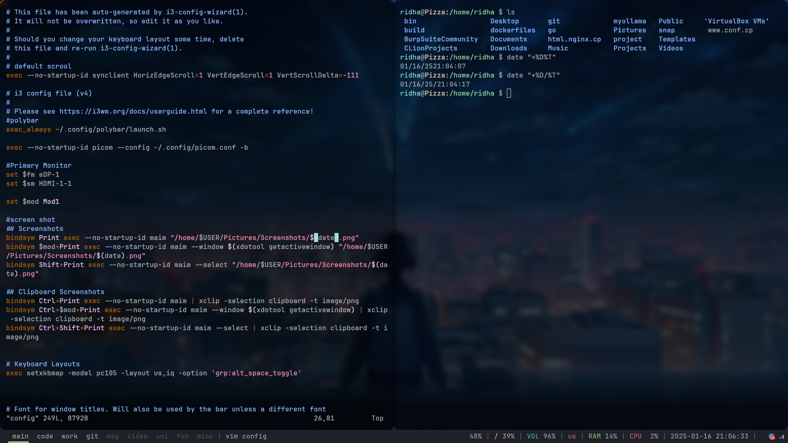

# i3 config files 

this is some of my files and some are from the other people to customize your
i3 wm for easy 

## Installation

use git clone

```bash
git clone https://github.com/hotdeth/config.git
```

## Usage
```
after you clone the repository 
just copy the files you need to ~/.config directory that after you install i3 wm and setup the system
```
## the requirements
- [i3 WM](https://i3wm.org/)
- [kitty](https://github.com/kovidgoyal/kitty.git)
- [polybar](https://github.com/polybar/polybar.git)
- [picom](https://github.com/yshui/picom.git)

